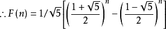

# 斐波那契数列及其简单应用  （Fibonacci Sequence and its Simple applications）
## 1.引言 & A brief Introduction
### 1.1 起源与发现过程
在1202年的数学书籍上Liber Abaci，意大利数学家莱昂纳多·斐波那契（Leonardo Fibonacci）提出了基于“兔子繁殖”的数学问题:著名的斐波那契数。(Picture 1 )该繁殖问题的题目为：兔子在出生两个月后，就会有繁殖能力，一对具有繁殖能力的兔子在每一个月能生出一对小兔子（一雄一雌），这里假设兔子没有死亡。今有一对新生的小兔，在一片田地上，在第12个月或更多个月时候，共有几对兔子？

### 1.2 后人的补充证明与发现
*通过对问题描述的分析，我们可以列出这样一个表格：*
月份|1|2|3|4|5|···|11|12|
:-|:-:|:-:|:-:|:-:|:-:|:-:|:-:|:-:|
兔子总数（对）|1|1|2|3|5|···|89|144|
新生兔子数（对）|0|0|1|1|2|···|34|55|
那么通过观察及推理判断，我们可以得出每一项的值都是前两项数字的和，即可以表达为F(n+1) = F(n) + F(n-1)，n为大于1的自然数。
## 2.相关数学问题
### 2.1上台阶问题（排列组合）
_问题介绍：上台阶时，只能一次上**一级或两级**，那么上到第十节台阶一共有几种上的方法？_
分析：显然，在这里，我们只需要考虑如果要上到第十节，其必然是从第九节或者第八节台阶上来的，若把上第十节台阶的不同方法数设为A10，则A10 = A9 + 
A8，以此类推，当上n级台阶时候，则An = An-1 + An-2，与 1.2 中的显然是一样的表达式。
### 2.2猜数问题
_问题介绍：写下任意两个1~9之间的数（未知），按照斐波那契数列的方法算出第十项，只要知道第二十项，在不知道其前面的数的情况下，就可以知道第二十一项是什么数_
分析，在类斐波那契数列（首两项不为1,1但满足其递推公式的数列），我们在写出这种数列的第10项后，发现随着项数增大，前一项/后一项的比值趋近0.618033···（黄金比例的值）。因此，只要项数足够大，我们就可以根据一个给定正整数来算出它的后一项（保留到整数），（事实上，项数大于15就完全可行，有些情况下甚至更小就可以。）
## 3.斐波那契数列的通项公式与常规方法推导
### 3.1 通项公式

### 3.2简易推导
Fn+1 = Fn + Fn-1
Fn+1 + k Fn= (1+k) Fn + Fn-1
得到
1/k = (1+k)/1
得k^2 + k = 1
分别将解得k1,k2代入，
写出分别含有k1,k2的、{Fn+1 + k Fn}的通项公式，
Fn+1 + k1 Fn = （1+k1）Fn + Fn-1------①
Fn+1 + k2 Fn = （1+k2）Fn + Fn-1------②
再用两式相减,得到 3.1 中的通项公式

## 4.在生活中出现的例子
1.海螺的螺纹是斐波那契螺旋线。
2.菠萝、棕榈树、玫瑰等植物的花瓣或表皮数量都为斐波那契数。
······
