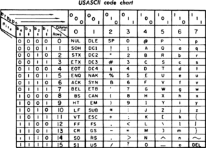

# 名词解释（By Wikipedia）& Answers to Questions.
## PART1：名词解释
### What is ASCII?
ASCII is short for American Standard Code for International Interchange.  
Here is a list of ASCII code chart.  
  
ASCII is a character encoding standard for electronic communication.   
ASCII codes represent text in computers, telecommunications equipment, and other devices.   
Most modern character-encoding schemes are based on ASCII, although they support many additional characters.  
ASCII is the traditional name for the encoding system; the Internet Assigned Numbers Authority (IANA) prefers the updated name US-ASCII,   
which clarifies that this system was developed in the US and based on the typographical symbols predominantly in use there.  
ASCII码是一种电子通信领域的编码标准，代表着计算机、电子通讯设备等设备上的字符。  
大部分现代的字符编码是基于ASCII码，尽管ASCII码还代表着许多附加的字符。  
ASCII是编码传统的名字，IANA更喜欢用US-ASCII这种改进版的名字，因为这叫法体现了这个命名系统诞生发展于美国和其主要基于印刷代码以进行应用。  

### Color
#### Defination：  
Color (American) or colour (Commonwealth English) is the characteristic of human visual perception described through color categories, with names such as red, orange, yellow, green, blue, or purple.   
#### How we can see different colors?  
This perception of color derives from the stimulation of cone cells in the human eye by electromagnetic radiation in the visible spectrum. Color categories and physical specifications of color are associated with objects through the wavelength of the light that is reflected from them.  

## PART2:Answers to Questions   

### 1）
|Character|ASCII|  UniCode|UTF-8|  
|--|--|--|-|   
|A|65|&#x0041|0041|  
甲|   \u7532  |30002(十进制)|%E7%94%B2

### 2）Yellow(RGB):(红255,绿255,蓝0)  
### 3）从网上下载一个BMP 格式图像,用图片编辑工具另存在jpg、png、
tiff 格式。问三种格式中,哪种格式显示质量好?相对于BMP 格式,压缩率各是多少?

答：png格式显示的质量最好。JPG压缩比为100:1~5:1；tiff压缩比为2：1左右；png压缩率可在70%左右。

### 4) Winrar压缩文件是lossless, or lossy 方法？
是lossless方法（lossless 或者 接近 lossless)。
