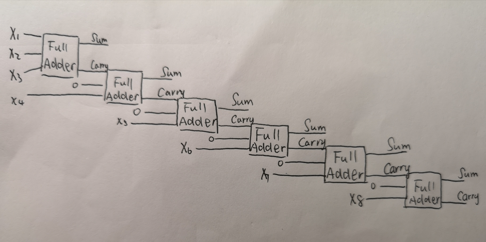

# 门电路的表示&二进制数字加法表示&名词解释
## 门电路的表示(=/_represents electricity wire)
### 1.AND Gate
Three Possible Representations of AND：只两项为真才为真  
1. = (NOT) __ (NAND) __   

2. ==   (OR)_____  
   ||= (XOR)_|

3. ==(NAND)___(NOR)---  
   ||=(NOR)_|  

### 2. XOR Gate 同假异真： 
Three Possible Representations of XOR:
1. ==(OR)____(AND)__  (NOT)__  
   ||=(AND) _ | 

2. ==(OR) _____(AND)___  
  ||=(NAND)____|   

3. == (AND) __ (NAND)_  
   ||_(OR)__|

### 3. Draw a circuit diagram corresponding to the following Boolean expression: (A + B)(B + C)

### 4.The Truth Table is as follows:  
  InputA|InputB|Output
  -|-|-
  0|0|1
  1|0|0
  0|1|1
  1|1|1

  ### 5.What is circuit equivalence? Use truth table to prove the following formula.(AB)’ = A’ + B’
  The Circuit Equivalence is that the outline of the circuits are different ,but they have the SAME Outputs.

  InputA|InputB|Output(AB)'|A'+B'
  -|-|-|-
  0|0|1|1
  1|0|1|1
  0|1|1|1
  1|1|0|0  

  ### 6.There are eight 1bit full adder integrated circuits. Combine them to 8bit adder circuit using the following box diagram.
  Suppose:X
8
X
7
X
6
X
5
X
4
X
3
X
2
X
1  (2)is a binary number.

  
  ### 7.Fill the Blank
  (1)  (X
8
X
7
X
6
X
5
X
4
X
3
X
2
X
1
)
2
or (00001111)
2
= (X8 X7 X6 X5 1111)
2  
(2)  (X
8
X
7
X
6
X
5
X
4
X
3
X
2
X
1
)
2
xor (00001111)
2
= (X8 X7 X6 X5 1-X4 1-X3 1-X2 1-X1)
2  
(3)  ((X
8
X
7
X
6
X
5
X
4
X
3
X
2
X
1
)
2 
and(11110000)
2 
)
or  (not (X
8
X
7
X
6
X
5
X
4
X
3
X
2
X
1
)
2
and (00001111)
2
)  =  (X8X7X6X5 1-X4 1-X3 1-X2 1-X1)
2

## 使用Wiki翻译解释名词
### 1）Logic Gate：  
In electronics, a logic gate is an idealized or physical device implementing a Boolean function; that is, it performs a logical operation on one or more binary inputs and produces a single binary output. Depending on the context, the term may refer to an ideal logic gate, one that has for instance zero rise time and unlimited fan-out, or it may refer to a non-ideal physical device .    

For Example : Logical expression NOT is presented as followed.

### 2)Boolean Algebra:   
In mathematics and mathematical logic, Boolean algebra is the branch of algebra in which the values of the variables are the truth values true and false, usually denoted 1 and 0 respectively. Instead of elementary algebra where the values of the variables are numbers, and the prime operations are addition and multiplication, the main operations of Boolean algebra are the conjunction and denoted as ∧, the disjunction or denoted as ∨, and the negation not denoted as ¬. It is thus a formalism for describing logical relations in the same way that elementary algebra describes numeric relations

### 3)存储电路（Flip-Flop)
flip-flop 指边沿触发的触发器，中文名字为 “触发器”。  
 SR latch可以储存一位信号，即能储存 1 bit.

  
