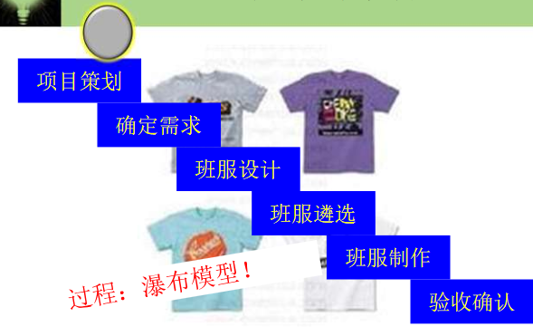

#hw08
## Decimal to hexadecimal
1. Pseudocode:
READ (decimal number )x
WHILE x is not 0
i=0
hexaDigits = 0/1/2/3/4/5/6/7/8/9/a/b/c/d/e
hexaDigits[i] equals to the remain of the x/16
number = number / 16
i++
END WHILE 
FOR(i;i>0;i--)
print hexaDigits[i]
END FOR
2. C language:
>#include <stdio.h>  
int main (){  
    int num,count=0;  
    char digits[];  
    for (int i=0;num!=0;i++){  
        int remNum = num % 16;   
        num /= 16; 
        switch (remNum){   
        case 15 :  
        digits[i] = f;break;  
        case 14 :  
        digits[i] = e;break;   
        case 13 :     
        digits[i] = d;break;  
        case 12 :  
        digits[i] = c;break;  
        case 11 :    
        digits[i] = b;break;  
        case 10 :  
        digits[i] = a;break;  
        case 9:  
        case 8:  
        case 7:  
        case 6:  
        case 5:  
        case 4:  
        case 3:  
        case 2:  
        case 1:  
        case 0:  
        digits[i] = remNum;  
        }  
    }  
for (;i>0;i--){
printf("%s",digits[i]);  

}  
}  

3. Outputs:  
-1  
0  
1  
f  
1a  
cc1;

## 名词解释与对比
### TOP-DOWN DESIGN
Top-down is a strategie of information processing and knowledge ordering, used in a variety of fields including software, humanistic and scientific theories (see systemics), and management and organization. In practice, it can be seen as a style of thinking, teaching, or leadership. 

A top-down approach (also known as stepwise design and in some cases used as a synonym of decomposition) is essentially the breaking down of a system to gain insight into its compositional sub-systems in a reverse engineering fashion. In a top-down approach an overview of the system is formulated, specifying, but not detailing, any first-level subsystems. Each subsystem is then refined in yet greater detail, sometimes in many additional subsystem levels, until the entire specification is reduced to base elements. A top-down model is often specified with the assistance of "black boxes", which makes it easier to manipulate. However, black boxes may fail to clarify elementary mechanisms or be detailed enough to realistically validate the model. Top down approach starts with the big picture. It breaks down from there into smaller segments. 

So,a top-down design is to say that one approach of design is mainly seen from the top of the problem,which looks like an operation with a GODVIEW.

### Work breakdown structure
A work-breakdown structure (WBS) in project management and systems engineering, is a deliverable-oriented breakdown of a project into smaller components. A work breakdown structure is a key project deliverable that organizes the team's work into manageable sections. The Project Management Body of Knowledge defines the work-breakdown structure "A hierarchical decomposition of the total scope of work to be carried out by the project team to accomplish the project objectives and create the required deliverables."

A work-breakdown structure element may be a product, data, service, or any combination thereof. A WBS also provides the necessary framework for detailed cost estimating and control along with providing guidance for schedule development and control.

### Similarities AND Differences
In my opinion,Top-down design is a kind of way to solve some problem in whole,or solve some problem step by step,because the problem is solved by making progress in one solving way.   
In a word,

Usually, the work breakdown structure is team work which can be devided by several blocks tfor different teams or people to work.
Work breakdown structure is more like   

If the problem is building  something for many people to live in ,top-down design is more like building a 100-floor-high hotel from the bottom,level by level,but work breakdown structure is to build ten 10-floor-hotel to accomodate the same number of guests.

