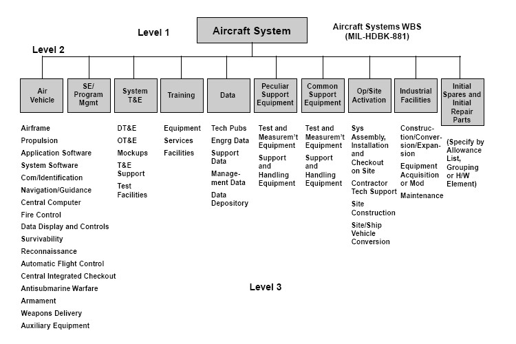

# hw08
## Decimal to hexadecimal
1. Pseudocode:
READ (decimal number )x
WHILE x is not 0
i=0
hexaDigits = 0/1/2/3/4/5/6/7/8/9/a/b/c/d/e
hexaDigits[i] equals to the remain of the x/16
number = number / 16
i++
END WHILE 
FOR(i;i>0;i--)
print hexaDigits[i]
END FOR
2. C language:
>#include <stdio.h>  
int main (){  
    int num,count=0;  
    char digits[];  
    for (int i=0;num!=0;i++){  
        int remNum = num % 16;   
        num /= 16; 
        switch (remNum){   
        case 15 :  
        digits[i] = f;break;  
        case 14 :  
        digits[i] = e;break;   
        case 13 :     
        digits[i] = d;break;  
        case 12 :  
        digits[i] = c;break;  
        case 11 :    
        digits[i] = b;break;  
        case 10 :  
        digits[i] = a;break;  
        case 9:  
        case 8:  
        case 7:  
        case 6:  
        case 5:  
        case 4:  
        case 3:  
        case 2:  
        case 1:  
        case 0:  
        digits[i] = remNum;  
        }  
    }  
for (;i>0;i--){
printf("%s",digits[i]);  

}  
}  

3. Outputs:  
-1  
0  
1  
f  
1a  
cc1;

## 名词解释与对比
### TOP-DOWN DESIGN
Top-down is a strategie of information processing and knowledge ordering, used in a variety of fields including software, humanistic and scientific theories (see systemics), and management and organization. In practice, it can be seen as a style of thinking, teaching, or leadership. 

A top-down approach (also known as stepwise design and in some cases used as a synonym of decomposition) is essentially the breaking down of a system to gain insight into its compositional sub-systems in a reverse engineering fashion. In a top-down approach an overview of the system is formulated, specifying, but not detailing, any first-level subsystems. Each subsystem is then refined in yet greater detail, sometimes in many additional subsystem levels, until the entire specification is reduced to base elements. A top-down model is often specified with the assistance of "black boxes", which makes it easier to manipulate. However, black boxes may fail to clarify elementary mechanisms or be detailed enough to realistically validate the model. Top down approach starts with the big picture. It breaks down from there into smaller segments. 

So,a top-down design is to say that one approach of design is mainly seen from the top of the problem,which looks like an operation with a GODVIEW.

### Work breakdown structure
A work-breakdown structure (WBS) in project management and systems engineering, is a deliverable-oriented breakdown of a project into smaller components. A work breakdown structure is a key project deliverable that organizes the team's work into manageable sections. The Project Management Body of Knowledge defines the work-breakdown structure "A hierarchical decomposition of the total scope of work to be carried out by the project team to accomplish the project objectives and create the required deliverables."

A work-breakdown structure element may be a product, data, service, or any combination thereof. A WBS also provides the necessary framework for detailed cost estimating and control along with providing guidance for schedule development and control.

### Similarities AND Differences
In my opinion,Top-down design is a kind of way to solve some problem in whole,or solve some problem step by step,because the problem is solved by making progress in one solving way.   
In a word,

Usually, the work breakdown structure is team work which can be devided by several blocks tfor different teams or people to work.
Work breakdown structure is more like   

If the problem is building  something for many people to live in ,top-down design is more like building a 100-floor-high hotel from the bottom,level by level,but work breakdown structure is to build ten 10-floor-hotel to accomodate the same number of guests.

# 洗衣机算法设计
## 1）请使用伪代码分解“正常洗衣”程序的大步骤。包括注水、浸泡等
>A：The Pseudocode of a general procedure of a washer.

正常洗衣：  
SET RollingCOUNT = 1  

SET water_in_switch(open)  
GET get_water_volume（70centimetre)    
SET water_in_switch(close)  
motor_run(left)  
motor_run(stop)  
motor_run(right)   
 
SET water_out_switch(open)  
SET water_out_switch(close)  

##  2）进一步用基本操作、控制语句（IF、FOR、WHILE等）、变量与表达式，写出每个步骤的伪代码  
SET RollingCOUNT = 1  
FOR RollingCOUNT = 1 to 10  
SET water_in_switch(open)  
GET get_water_volume（70centimetre)    
SET water_in_switch(close)  
motor_run(left)  
motor_run(stop)  
motor_run(right)   
motor_run(left)     
motor_run(stop)  
motor_run(right)  
motor_run(left)  
motor_run(stop)  
motor_run(right)  
SET water_out_switch(open)  
SET water_out_switch(close)  
END FOR   
if RollingCOUNT >= 10  
halt(success)  

## 3）根据你的实践，请分析“正常洗衣”与“快速洗衣”在用户目标和程序上的异同。你认为是否存在改进（创新）空间，简单说明你的改进意见
正常洗衣是以较低能耗进行运作，洗衣机以较低能耗翻转滚筒同时，还要固定几秒钟停转，经过多次加水放水达到洗衣的效果。  
而快速洗衣主要是将停转时间减少至最低甚至0（视不同功能洗衣机而定），而同时将转速较加快正常洗衣而加快，从而达到快速洗衣的效果。    
改进空间有：快速洗衣可以将甩干功能加入到洗衣后期，在快速甩干过程中也可以将尘垢清除。创新的方面：可以考虑一种更加高效的洗衣方式，以更少水达到清洁的目的，这样既可以节省甩干时间达到更快，又可以节约水资源。 

与此同时，由于通电时间短，降低了电流白白流过的时间，若不做对外的功而通电，造成电的利用效率不高。

## 4）通过步骤3），提取一些共性功能模块（函数），简化“正常洗衣”程序，使程序变得更利于人类理解和修改维护。例如：wait(time) //等待指定的时间;注水(volume,timeout) //在指定时间内完成注水，否则停机；排水(timeout)。
function wait(time)   
count = 0   
WHILE wait = 1s ,count < time   
count++   
END WHILE    
END fuction  

function waterIn(volumeNeeded,timeout)    
water_in_switch(open)     
current = get_water_volume()  
FOR   current=get_water_volume  () to volumeNeeded  
keep the switch open  
IF time == timeout   
stop the machine  (halt())   
END IF
END FOR  
IF time == timeout   
stop the machine (halt())   
END IF
IF　current == volumeNeeded  
water_in_switch(close)   
END IF  
END function  

function waterOut(minVolumeNeeded,timeout)    
water_out_switch(open)     
current = get_water_volume()  
FOR   current=get_water_volume  () to volumeNeeded  
keep the switch open  
END FOR  
IF　current == volumeNeeded  
water_out_switch(close)  
END IF  
END function  

main :  
FOR count = 0 to 10  
waterInIF (volumeNeeded,timeout)  
FOR countRoll = 0 to 5  
motor_run(left) 3*360°   
motor_run(stop)  
motor-run(right)  3*360°    
END FOR  
waterOut(minVolumeNeeded,timeout)  
END FOR  

