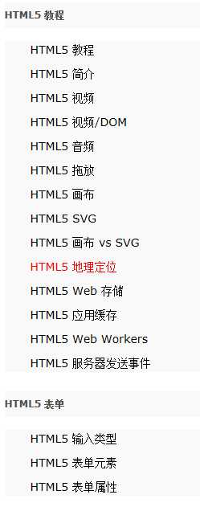
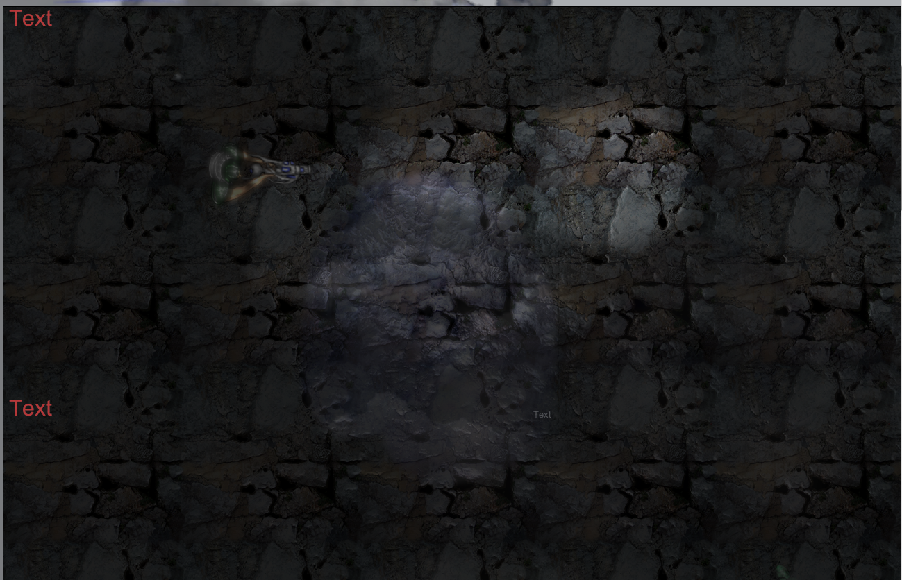
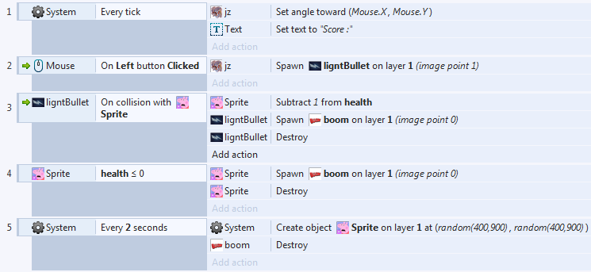

# 使用Construct2制作第一款小游戏---by 宿永烨（18342107）SYSU  
## 准备过程  
在准备过程中，听说过一些小游戏开发的实例，就抱着试试的心态去CSDN上面看HTML5的教程。  
  
DOM???  
SVG???  
画布???  
拖放???  
音频???  
······   
Are You Kidding me?  
然而身边的同学已经有做出来还录了视频的???  
带着崇拜的眼神去问做出来的同学，得到的回答是：Construct2 上面就能直接做的！不用写代码 × 3！  
打开后，打开了一个样板小游戏:Ghost Shooter  
  
发现其中的游戏元素包括：
BackGround 背景；  
Sprite 精灵（我觉得可以叫Object）； 
Text 文本信息；  
等等···  
----------------
切入正题，我的游戏背景是这样的：  
在另一维度的世界中，Peppa Pig占领了人类的精神世界，宙斯十分不悦于这种长着电吹风头的动物，于是开始用自己的神力驱逐这些Peppa Pigs！
----------------
游戏主要元素与以上列出的相同：  
生成游戏中的元素只要双击背景即可，有没有感觉到Photoshop的味道呢？  
## 设置背景  
双击背景之后，Tiled Background可以把你的图片自动平铺满整个画面。  
## 导入你的游戏中的（Player&Enemies）
双击背景，Insert new project 里面可以挑选你希望要的要素，大部分情况下，都是Sprite！  
然后在导入你的图片，注意，在设置完毕后你也可以再继续双击该Sprite以更换其设置。
值得一提的是，只要按住Ctrl键移动你的Sprite，即可完全复制，无需手动添加N个sprite。
## 记分牌
只需要先在“Game”页面中双击背景加入Text，在后面的GameEvents中会有用到。   
## 参数功能设置    
对于游戏中不同的元素，需要对其参数功能进行设置以达到游戏的设计目的。  
对于Player（Zues）：需要使用键鼠（Keyboard&Mouse）以控制其走位、攻击等动作，在左侧的instance variables和 behaviors里面设置相应的参数及功能。
在Insert New Object/Input里面有Mouse和Keyboard，设定了这两项之后才可以用键鼠进行操作！  
----------------
# GameEvents（有点编程的意思了）  
首先需要说明的是，由于没有设置玩家血量（Health），该游戏可以认为是无敌版，但是会有击杀敌人的记分牌（之前的TEXT）。  
sheet如下图：  

再点击左上角的Run Layout按钮（像播放键一样），即可在IE浏览器支持下开始这款游戏啦！

