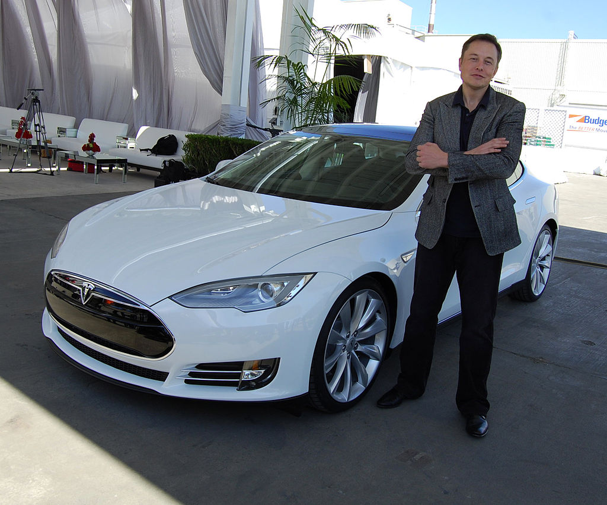

# A brief introduction of Elon Musk and his Goals

## Born in South Africa
埃隆·马斯克（Elon Musk），1971年6月28日出生于南非的行政首都比勒陀利亚，他的父亲是一名机电工程师，母亲是一名模特，父母亲在他小时候离婚，他跟父亲一起生活。  
也许是由于父亲的影响，马斯克在很小的时候就对各式各样的科技感兴趣，1981年，10岁的埃隆·马斯克利用自己攒的零花钱和父亲赞助的部分资金买了人生中第一台电脑，之后又买了一本编程教科书，并且学会了如何编程。这是他之后在IT行业（还有航天、机械等）领域迈出的第一步，也是非常伟大的一次进步。1983年，12岁的埃隆·马斯克成功设计出一个名叫“Blastar”的太空游戏软件，之后以500美元的价格出售给了《PC and Office Technology》杂志，赚到了人生的第一桶金。    
1989年，在高中毕业、居住加拿大一年后，埃隆·马斯克获得加拿大国籍，并于次年申请进入了位于安大略省的皇后大学。  
## Starting HIS Glory
1992年，埃隆·马斯克依靠奖学金转入美国宾夕法尼亚大学沃顿商学院攻读经济学，大学期间，埃隆·马斯克开始深入关注互联网、清洁能源、太空这三个影响人类未来发展的领域。 埃隆·马斯克在取得经济学学士学位后，又留校一年拿到了物理学学士学位。可见其不仅仅学习能力突出，对未来也相当有所规划。
这也许是他年轻时最最令我吃惊的决定，1995年，24岁的埃隆·马斯克进入斯坦福大学攻读材料科学和应用物理硕士课程，但在入学后的第2天，埃隆·马斯克决定离开学校开始创业。肄业生，多么熟悉的名词，带着这个标签的伟大名字还有史蒂夫·乔布斯（Steve Jobs），比尔·盖茨（Bill Gates），拉里·埃里森（Larry Elison）······等等，太多富有传奇色彩的名字。
### Goal 1 :Internet：Zip2
但是，未来的硅谷Tony Stark,怎么会因为褪去了斯坦福大学的光环而泯然众人？与弟弟卡姆巴·马斯克（Kimbal Musk）一道，他拿着硅谷一个小创业集团的天使投资，创办了Zip2公司,值得一提的是,这个主要为新闻出版商开发在线内容出版软件的小公司，当时已经成为《纽约时报》和《芝加哥邮报》的合作商。1999年，美国电脑制造商康柏公司以3 .07亿美元现金和3400万美元股票期权收购了Zip2公司，28岁的埃隆·马斯克在这笔收购中获利2200万美元。
### Goal 1 : Internet : The Extraordinary **PAYPAL**

2000年，埃隆·马斯克为解决在网上快捷转账业务上的竞争，将其原来在硅谷与人合伙开的在线金融服务和电子邮件支付业务公司X.com公司，与彼得·蒂尔等人创办的Confinity公司合并，这家新公司于次年2月PayPal。从某种意义上说，Musk其实是在线支付等金融服务在全球范围内的先驱者。
### Goal 2 & 3 :Clean Energy and Space:**Tesla**&**Rocket**&**SPACE X**
更多地让我对Musk感到敬佩的是，他的眼光始终处于人类世界至少20年以后。图为马斯克与他的机器人生产力。

2001年，他还在Paypal的时候，就已经开始策划“火星绿洲(Mars Oasis)”的计划了，该项目包括试着通过俄罗斯的运载火箭来搭载一个温室，让地球的农作物可以在火星上生长，以此为人类开拓太空居住地而做出尝试，从这一点上，马斯克的征程真正是星辰大海。  
如那句名言所说的一样，良好的开端，是成功的一半，到这里他的目标其实完成了一个半，还有另外一个半。   

2008年，金融危机爆发，马斯克也迎来了人生低谷。他的火箭三次发射都失败了，数千万美元的投入化成爆炸后的大火球，因为研发成本过高，Tesla也濒临破产。

2010年6月，Tesla在纳斯达克上市，成功完成IPO，净募集资金约1.84亿美元。在上市前几天，纽约时报爆出马斯克已经濒临破产。上市后，马斯克在帐面上赚了6亿3千万美元。Tesla成为自1956年福特汽车IPO以来第一家上市的美国汽车制造商，也是仅有的一家在美国上市的纯电动汽车独立制造商。SpaceX从2007年开始就盈利了，Tesla获得美国国家能源部4.65亿美元的低息贷款，并以每辆10万美元卖出了不少电动跑车，并成为奔驰Smart车的电池供应商。丰田和奔驰都投资了Tesla，但他的账面财富仍然不充裕。

2010年12月8日，马斯克的SpaceX太空探索技术公司研发的猎鹰9号火箭成功将“龙飞船”发射到地球轨道，这是全球有史以来首次由私人企业发射到太空，并能顺利折返的飞船。整个宇航界为之震动。根据NASA的计划，当美国所有航天飞机2011年退役以后，将依赖像SpaceX公司这样的私营公司将物资补给送入国际空间站。
  
 -----------------
 ## Enough ?
 ## Absolutely NOT ! ! !

接下来还要搞事情！  
譬如：推力 & Recyclable 了解一下！  
在2012年5月31日，马斯克旗下公司SpaceX的“龙”太空舱成功与国际空间站对接后返回地球，开启了太空运载的私人运营时代。  
2016年4月9日，SpaceX完成了猎鹰九号一级火箭在海上回收。  
2018年2月7日，重型猎鹰”运载火箭在美国肯尼迪航天中心首次成功发射，并成功完成两枚一级助推火箭的完整回收。上面还有一辆2008年生产的电动汽车和一个宇航员模型，标签是“Made BY Humans”   

接着搞事情！照亮加州有木有！湾区UFO？？？http://www.sohu.com/a/258530708_114837  
他的传奇，还在继续！
To Be Continued！
