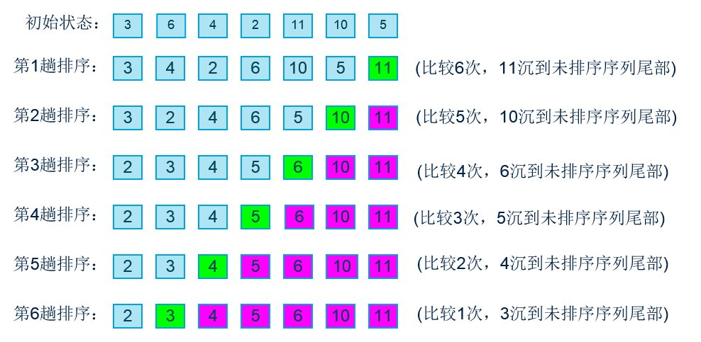
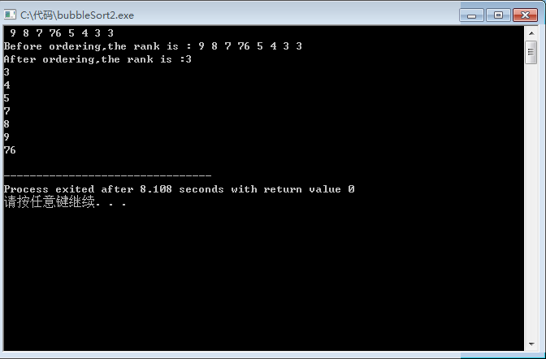

# 关于实现冒泡排序的技术博客 by SuYongye(18342107) SYSU
## An introduction to this method.
冒泡排序（Bubble Sort）是一种典型的交换排序算法，通过交换数据元素的位置进行排序。  

比如：两个相邻的数字 91 与 19，在此次我们规定从左到右是由小到大，则 19 与 91 交换位置以满足该排列规则；更多地，91 30 19，不妨从最左边的91开始与右边的数比较，第一轮：91与30比较，换位，91在原来左二的位置下与左三的19的比较，再换位；第二轮，再次从左一开始和右边的数比，交换，以此类推，不妨可以通过图解了解其原理。  

算法的核心在于每次通过两两比较交换位置，选出剩余无序序列里最大（小）的数据元素放到队尾。 

以下是我在看过这个算法之后写的关于冒泡排序算法实现的代码，目前只能实现预设好的数字的排列（若知道样本容量，可以通过改变整形变量n(在本程序中为8)的值适应用户的需求！）
## 代码如下：
    #include <stdio.h> 

    int main ()

    {
    int i, j,temp;  
    int array[8];  
    for (i = 0;i <8 ;i++)  
    {   
       scanf ("%d",&array[i]);      
       //通过数组和循环输需要排序的数列  
    }
    printf ("Before ordering,the rank is : ");
    
    for (i = 0;i < 8 ; i++)
    {
       printf ("%d ",array[i]);
    }
    printf ("\n");         //显示排序之前的数组
    for (j = 0;j < 8; j++)
    {
       for(i = 0;i < (7-j); i++)  //两次循环实现排序
           {
              if (array[i] > array[i+1]) 
                //相邻两数字比较
              {
                  temp = array[i];
                  array[i] = array[i+1];
                  array[i+1] = temp;      
             //中间变量temp实现相邻元素的交换
               }                                
           }
    }
    printf ("After ordering,the rank is :");  
    for(i = 0;i < 8 ; i++)  
    {
       printf ("%d ",array[i]); 
	   printf ("\n");        //显示排序后的数组
    }
    return 0;
    }

输入：9 8 7 6 5 4 3 2  
输出：
## 一些改进措施和优化
值得一提的是，在我阅读相关算法知识时，了解到这种算法其实有很多种优化措施，本人在其中运用了只需比较（n-1）轮的小小的优化，其实有更多的优化措施，笔者正探索当中······比如设定一个布尔类型的issorted（）函数，插入到for循环中，在后面加上

        if（issorted（array[n]）==1）；
        break;

就可以实现若已经为有序数列，则退出程序，减少了时间复杂度，也使程序更加高效！