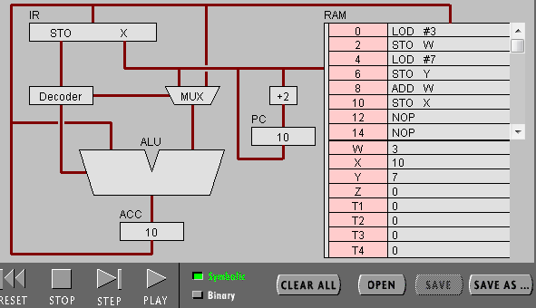
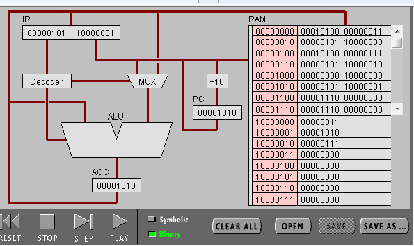
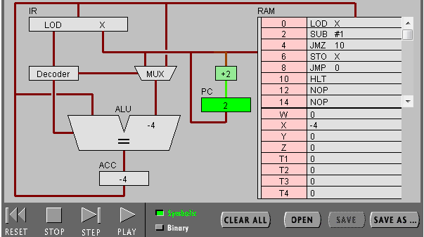
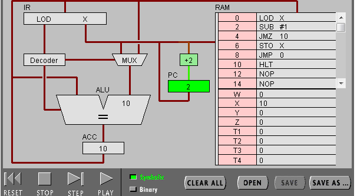
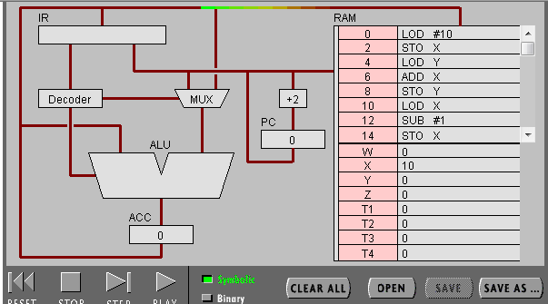
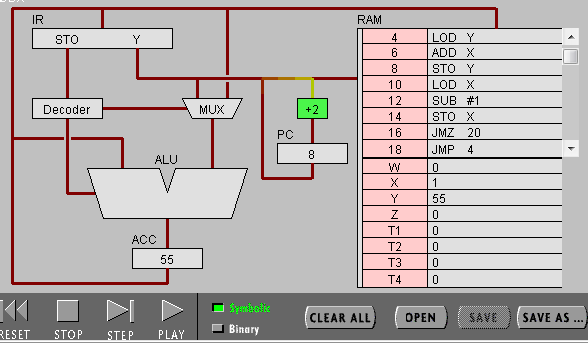

# 关于机器语言及机器语言编程的实验报告
## 18342107  SYSU 宿永烨
##关于实验目标
1、了解ACC、PC、IR寄存器的全称与作用，并且通过观察指令的执行过程理解fetch-execute周期,了解基本的指令结构及二进制（机器语言）运作过程
2.理解机器语言程序的运作以及过程。

------------------------------------
## 实验步骤与结果
### Project 1：
这是程序开始

 开始运行  

 对应的二进制码

### Project 2：
这是如果x未初始化的（default ：x=0）  

将x初始化为10之后，程序可以正常运行。  

这是经过修改后的程序  
    
执行中：
1
执行完成的结果（从10到1）  
  

-----------------------

## 实验小结
## Project 1
### STEP AFTER STEP:
1. PC (The Program Counter),which contains the address of the next instruction to be exececuted.  
IR (Instruction register),which contains a copy of the instructionbeing executed.

2. ACC ,is short for Accumulator,which is used to hold data and the result of operation,an accumulator is a register in which intermediate arithmetic and logic results are stored.

3. LOD #3：获得该指令后，指令被存在IR寄存器中，Decoder(解码器)对该指令进行解码操作，将前半部分的LOD作为命令传输到ALU中,并将后半部分的3通过MUX命令传入ALU中得到了ALU右边的数字3，寄存入ACC寄存器中。PC指令数加二代表该步骤已经执行完毕，下一步准备就绪。

4. ADD W:获得该指令后，该指令被寄存在IR寄存器中，Decoder对该指令进行解码操作，将ADD指令传输到ALU中,命令MUX将W的值从ACC中读取出来传入ALU,ALU根据命令ADD将两值相加，并且将执行结果传入ACC中寄存.PC计数器加2，下一条指令准备就绪。

5. LOD#3与ADD W之间的区别在于，LODz指令直接读取已给的操作数，而ADD指令需要把寄存器中的数字读取出来后在进行操作。

### Binary:
1. 00010100 00000111   0001表示最后八位的二进制数不是内存地址而是一个值 0100表示LOD 00000111表示的是7的二进制。  

2. RAM的地址：可以看出，需要利用内存空间的，后八位首位都是1，之后的七位二进制数字表示内存的地址。

3. 该CPU的内存地址有八位且为二进制，非16进制，八位二进制相当于为两位16进制数字，故该cpu有8位。 

4. int_8 a = 3;
   int_8 b = 7;
   int_8 c = 3 + 7;

## Object 2：
### 1) 循环递减程序
1. 该程序的功能是读取x内存中的值之后将其不断减一至0，但是，若x无初始值则默认从0一直开始无限减1。

2. 
  int x ;
  do {
    x--;
  }while (x != 0);

### 2) 修改后
3. 对应代码如下：

  int x = 10;
  int y = 0 ;
  for (x = 10 ; x > 0 ;x--){
      y += x ;
  }

4. 通过从寄存器中X获得X的初始值，先默认将x加在初始化值为0的y上面，再利用循环将x的值逐一递减，再继续加在y上面并且进行储存。

5. 通过高级语言我们可以更加高效率的汇编程序，将那些繁琐的二进制转换计算等等复杂步骤丢给擅长于计算的计算机。之间的过程(高级语言——>机器语言)是通过编译器实现的。