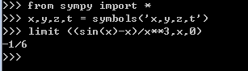
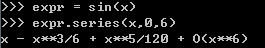
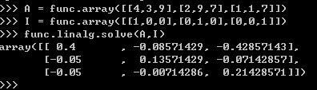
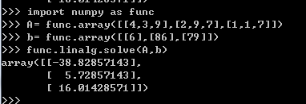

# Python编程实验报告
## 18342107 宿永烨  
## 实验目的
1.利用Python将计算机强大的计算功能进行泰勒公式等高数问题的计算  
2.解决线性代数方面的问题。  
## 实验工具
Winpython 64 bits  

Sympy Numpy  

## 实验流程  

配置实验环境：  
from sympy import *  
x,y,z = symbols('a,b,c')    
init_printing()   
import numpy as np   

### 高数问题计算（sympy）  
1.求极限  limit x->0:
(sin(x)-x)/x^3

  Markdown示例：  
  $$ \lim_{n \to +\infty} \frac{1}{n(n+1)} \quad and \quad \lim_{x\leftarrow{示例}} \frac{1}{n(n+1)} $$  

实际计算的是  
limit x->0:
(sin(x)-x)/x^3  
 计算结果如下：  
   

 2.泰勒展开式(Taylor series)  
 e^x/、sin(x)等等   
 在limit x->0时，也称之为麦克劳林展开，后方的o（x）成为拉格朗日余项。  
 具体实验输入输出结果如下：  
   

### 线性代数问题计算（numpy）  
1. By A*x* = b to slove the inverse of A.

This function is no like the question in 2,by using A^{-1} = IA
(I is identity matrix of square matrix in R^n)  
A= [[4,3,9],[2,9,7],[1,1,7]]  
The inverse of A is on the picture.  

2. Solutions of the argumented matrix.  
$$
\left\{ 
\begin{array}{c}

4x_1+3x_2+9x_3=6 \\ 
2x_1+9x_2+7x_3=86 \\ 
1x_1+1x_2+7x_3=79

\end{array}
\right. 
$$

As A*x* = b ,here goes the solution :

